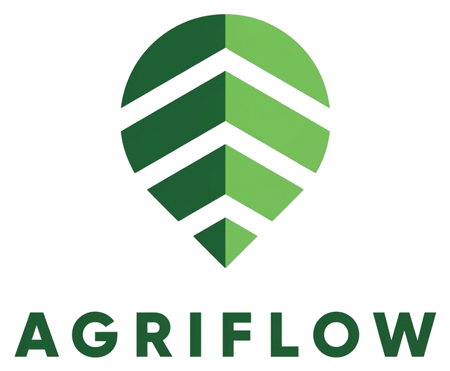
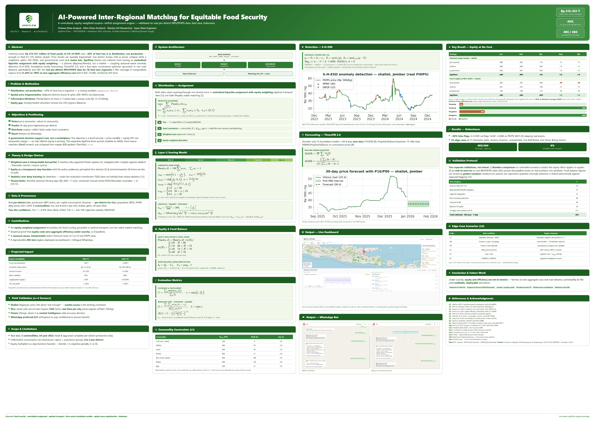
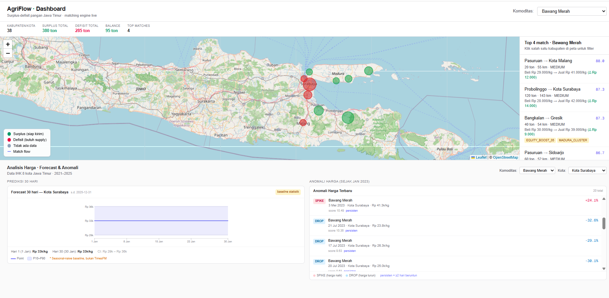
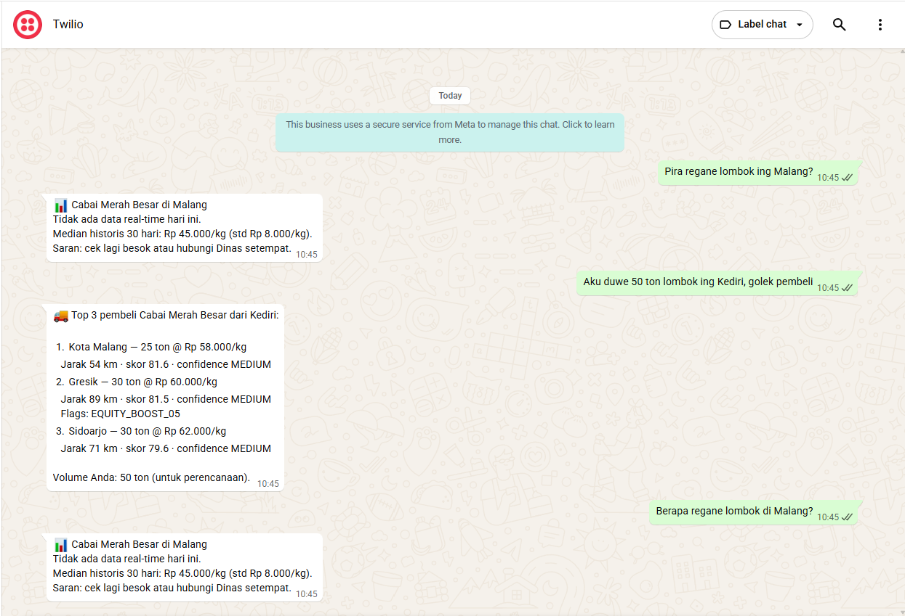

Language / Bahasa: [English](./README.en.md) · **Bahasa Indonesia**

<p align="center"></p>

<h1 align="center">AgriFlow</h1>

<p align="center">
  <strong>AI-Powered Food Security Intelligence Platform</strong><br/>
  <em>Platform Matching Demand–Supply Pangan Antarwilayah</em>
</p>

<p align="center"><b>Deteksi · Prediksi · Distribusi</b></p>

<p align="center">
  
  
  
</p>

> **Roadmap proyek dibagi 3 Phase.** README teknis lengkap versi sebelumnya diarsipkan di [`README_v13.md`](README_v13.md) (snapshot terbaru), [`README_v12.md`](README_v12.md), dan [`README_v11.md`](README_v11.md).

---

<details>
<summary><b>🖼️ Lihat Research Poster (klik untuk expand)</b></summary>

<br/>

<p align="center"></p>

</details>

---

# 📍 Phase 1 — Tim & Tautan

## Tim

| Nama | Role | LinkedIn |
|------|------|----------|
| Chelsea | Data Analyst | [Chelsea](https://linkedin.com/in/chelseaayu) |
| Hilmi | Data Architect | [Hilmi](https://linkedin.com/in/hilmi888/) |
| Monika | UX Researcher | [Monika](https://linkedin.com/in/monika-hermiani) |
| Irpan | Data Engineer | [Irpan](https://linkedin.com/in/irpanpilihanrambe) |

## Tautan

| Resource | Link |
|----------|------|
| Pitch Deck | [Canva](https://www.canva.com/design/DAHETj2ulzg/VIvgxVkQ6I9R24ucphy2mQ/view) |
| Dashboard (Live Demo) | [agriflow-engine.vercel.app](https://agriflow-engine.vercel.app/) |
| Proposal (v13) | [docs/AgriFlow_Proposal_v13.pdf](docs/AgriFlow_Proposal_v13.pdf) |

---

# 🚀 Phase 2 — Yang Sudah Kami Bangun (MVP)

## Masalah

Setiap tahun Indonesia kehilangan triliunan rupiah pangan — **40% terjadi di distribusi, bukan produksi**. Di satu kabupaten petani membuang cabai karena harga jatuh; di kabupaten sebelah harga melonjak karena langka. Pemda sering baru tahu krisis **2–3 minggu kemudian**.

## Solusi

**AgriFlow mencocokkan kabupaten surplus dengan kabupaten defisit** — seperti "Uber untuk pangan", tapi paham masa simpan (perishability), jarak jalan nyata, dan **keadilan untuk daerah tertinggal**. Tiga fungsi inti:

- **Deteksi** — temukan anomali harga (lonjakan/anjlok) dari data harga harian.
- **Prediksi** — perkirakan harga 30 hari ke depan.
- **Distribusi** — cocokkan surplus → defisit secara cerdas & adil.

## Arsitektur (High-Level)

```
   SUMBER DATA NYATA                AGRIFLOW ENGINE                  AKSES
  (BPS · PIHPS · OSRM)        ┌──────────────────────────┐
  produksi · konsumsi ──────▶ │ DETEKSI    anomali harga  │ ──┐
  harga · populasi            │ PREDIKSI   forecast 30 hr │   ├──▶ Dashboard peta
  per-kabupaten Jatim         │ DISTRIBUSI matching 4-lapis│  └──▶ WhatsApp bot
                              └──────────────────────────┘
```

Tiga fungsi (Deteksi · Prediksi · Distribusi) berbagi satu sumber data nyata, lalu disajikan lewat Dashboard & WhatsApp.

📄 **Detail metodologi tiap fitur — alasan pemilihan metode, cara kerja, evaluasi, validasi, dan sitasi paper: [Dokumen Arsitektur (PDF)](docs/AgriFlow_Architecture.pdf).**

## Fitur yang sudah berjalan

| Fungsi | Fitur | Status |
|--------|-------|:------:|
| **Distribusi** | Matching engine 4-lapis (hard constraints → multi-objective scoring → equity) berjalan di **data BPS asli per-kabupaten (2022)** | ✅ |
| **Deteksi** | Deteksi anomali harga (deseasonalize + robust statistics) pada harga PIHPS harian **2021–2025** | ✅ |
| **Prediksi** | Forecasting harga 30 hari. Yang **dilayani hari ini** adalah baseline seasonal-naive (`seasonal_naive_baseline`) dengan **MAPE 10,8%** pada [backtest holdout](docs/evidence/README.md#3-model-evaluation). Pipeline TimesFM 2.0 sudah ada di repo tetapi **belum melayani produksi** | ✅ |
| **Aksesibilitas** | **Chatbot WhatsApp** (tanya harga & rekomendasi) + **Dashboard** peta interaktif | ✅ |
| **Keamanan** | Situs bersifat *login-first*: membuka website menampilkan halaman login lebih dulu. Juri cukup klik **"Masuk sebagai Tamu"** untuk meninjau tanpa membuat akun. Akun Supabase (JWT terverifikasi server-side, Row Level Security di 12 tabel, reset password) siap untuk model berlangganan; data sensitif (langganan & pembayaran) tetap dijaga verifikasi JWT di sisi server. | ✅ |
| **Data nyata** | **6 komoditas** real per-kab: beras premium & medium, cabai merah & rawit, bawang merah & putih + harga PIHPS 5 tahun | ✅ |

> **Kualitas:** 523 tes otomatis lulus (524 terkumpul, 1 di-skip) — engine teruji, dapat direproduksi, dan jujur soal keterbatasannya (lihat [Pengujian & Skenario](#pengujian--skenario) dan Phase 3).
>
> 📁 **[Bukti pengujian lengkap](docs/evidence/README.md)** — test case, hasil eksperimen, model evaluation, performance test, A/B test, hasil simulasi, security test awal, error log, validation report, beserta instrumen UAT dan usability testing yang belum dijalankan.

### Cuplikan

**Dashboard** — peta Jawa Timur dengan bubble surplus/defisit per kabupaten, daftar *top matches*, plus panel **Forecast & Anomali harga** (ketiga fungsi dalam satu layar):



**WhatsApp Bot** — tanya harga, cari pembeli/pemasok, prediksi & anomali harga lewat chat. Mendukung **Bahasa Indonesia** dan **Bahasa Jawa** (inklusi petani daerah):

| Bahasa Indonesia | Bahasa Jawa |
|:---:|:---:|
|  |  |

## Pengujian & Skenario

Karena output AgriFlow menggerakkan alokasi pangan antar-kabupaten yang menyentuh daerah IPM-rendah, klaim "adil" dan "robust" harus dapat diaudit ulang — bukan sekadar narasi. Suite uji mengunci angka food-balance sebagai *golden numbers* (reproducibility), menjaga parameter kebijakan dari pergeseran tak sengaja (regression-safety), dan menguji deteksi anomali secara adversarial.

**524 tes terkumpul · 523 lulus · 1 di-skip · lintas-OS di CI.** ([keluaran mentah](docs/evidence/runs/pytest.txt))
(Skip = `test_timesfm_importorskip`: dilewati jika pustaka TimesFM tak terpasang di runner; jalur forecasting tetap diuji via fallback + kontrak API.)

Server produksi memuat **data BPS asli secara default** (`DATA_BACKEND=csv`, bawaan). Fixture sintetis 19-komoditas lama tetap dipakai di 13 file test (`DATA_BACKEND=demo`) untuk menguji logika engine di lebih banyak variasi komoditas — tidak pernah disajikan ke pengguna.

| Kategori | Jumlah | Cakupan |
|---|---|---|
| Unit per-layer (L0–L3) | 73 | Tier IPM, constraint jarak/perishability, skor, alokasi equity |
| 24 skenario edge-case (A–F) | 27+ | Volume, spasial, temporal, disrupsi, politis, kualitas |
| Validasi data nyata BPS/PIHPS | 57 | Food-balance beras + hortikultura 2022, pipeline reproducible |
| Deteksi anomali harga | 49 | S-H-ESD sadar-musiman pada residual deseasonalized |
| Forecast & API | 40 | Endpoint forecast/anomali + fallback |
| Baseline & equity | 39 | greedy/uniform/proporsional vs AgriFlow + skenario langka pasokan |
| Ingest & integrasi | 73 | DB loader, ingest PIHPS, jarak OSRM, bot WhatsApp |
| Autentikasi dashboard & kuota WhatsApp | 117 | Login Supabase, verifikasi JWT server-side, RLS 12 tabel, reset password, kuota gratis WhatsApp (nonaktif default) |

**24 skenario edge-case** memetakan kejadian nyata Jawa Timur, contohnya: Ramadan spike (C1), erupsi Semeru di Lumajang → unreachable (D4), banjir multi-kabupaten sentra padi (D5), kenaikan BBM → biaya logistik naik (E5), dan prioritas reserve kontrak Bulog (E3).

**Hasil kunci:**
- **Equity terbukti saat pasokan langka, biaya efisiensi nol.** *Ini uji-tekan hipotetis, bukan hasil data BPS asli:* Jawa Timur pada data 2022 justru sangat surplus (rasio 6,6×), sehingga nilai equity tidak akan tampak. Untuk menunjukkan cara kerja mekanismenya kami membangun skenario langka buatan (fixture `surplus_deficit_constrained.csv`, surplus 3962t vs defisit 5249t). Di skenario itu greedy murni menelantarkan Madura — Sampang **0%**, Bangkalan **20%**; AgriFlow mengangkat keduanya ke **100%** dengan *coverage agregat identik* (0.6649) dan Gini turun (0.3017 → 0.2905). Kami tidak mengklaim keunggulan equity saat pasokan melimpah, dan tidak mengklaim skenario ini berasal dari data nyata.
- **Anomali sadar-musiman.** Penurunan harga ~60% ter-flag, tapi pola musiman murni (siklus jelang Lebaran) **tidak** memicu false positive; anomali genuine di atas pola musiman tetap terdeteksi.
- **Data mengungkap defisit struktural, bukan bug.** Bawang putih menghasilkan **0 match** di seluruh 38 kabupaten pada data BPS 2022 — Jawa Timur defisit bawang putih di semua kabupaten, konsisten dengan Indonesia sebagai net-importir bawang putih. Engine bekerja benar; datanya yang bicara.

📄 Detail lengkap (kenapa, daftar 24 skenario, sitasi paper): [Dokumen Arsitektur](docs/AgriFlow_Architecture.pdf) §Pengujian & Validasi.

## Kenapa tech stack kami RINGKAS (bukan sebanyak proposal awal)?

Proposal awal mencantumkan stack besar (Qdrant, LangChain, Redis, n8n, multi-cloud, dll). Setelah benar-benar membangun, kami **sengaja memangkasnya** — *honest engineering* untuk skala saat ini (38 kabupaten Jawa Timur):

| Rencana awal | Yang kami pakai | Alasan |
|---|---|---|
| Qdrant (vector DB terpisah) | **Supabase pgvector** | Korpus kecil — tak perlu service vektor sendiri |
| LangChain | **Gemini API langsung** | RAG sesederhana ini tak butuh framework berat |
| Redis cache | **In-process cache** | Beban belum menuntut; engine deterministik |
| 5 platform hosting | **2 (HF Spaces + Vercel)** | Lebih sedikit titik gagal, lebih murah |

**Prinsip kami: pakai yang cukup, bukan yang ramai.** Komponen besar baru bernilai saat skala membenarkannya — dan itulah **Phase 3**.

## 🎙️ Validasi Lapangan — Wawancara Petani

Kami mewawancarai **4 petani lintas komoditas & skala usaha** — dari petani mapan dengan jaringan pasar sampai petani kecil yang terkurung tengkulak — untuk memvalidasi kebutuhan nyata dan menemukan gap AgriFlow. Tiap baris menyertakan **rekaman audio sebagai bukti**.

| Komoditas | Profil Narasumber | Pendapat Singkat | Rekaman & Transkrip |
|---|---|---|---|
| **Bawang Merah** | Denisa Septalian — petani penerus, Nganjuk (Ds. Ngudikan, Kec. Wilangan), 5 thn, lahan ±70 ru | **Setuju bersyarat.** Info harga saja "kurang efektif" karena 100% bergantung tengkulak & tak punya akses luar daerah — antusias bila AgriFlow membuka **akses pembeli luar kota**. | [🎧 Audio](https://drive.google.com/drive/folders/1kdF9KPqycrdN9GewRz6YKFUKWfzCaRVh) · [📄 Transkrip](interview/transcript-bawang-merah.md) |
| **Padi** | Petani 15 thn, lahan ±1 ha; jual gabah ~Rp5.800/kg ke tengkulak yang datang ke sawah | Info harga lintas daerah **membantu** sebagai gambaran; tertarik pembeli luar kota asal prosesnya aman; ragu "ribet" di awal & soal keamanan transaksi. | [🎧 Audio](https://drive.google.com/drive/folders/1-fpMk8UGg41wk1-RZufTyRBNNJwM7he7) · [📄 Transkrip](interview/transcript-padi.md) |
| **Cabai** | Petani baru (8 bln bertani, tanaman 50 HST), Solo/Karanganyar; sebelumnya jagung | **Sangat tertarik** harga real-time antar daerah untuk hitung kelayakan kirim; info FB/WA kini meleset Rp5.000–15.000/kg & hanya level provinsi. Menekankan UI sederhana untuk petani lansia. | [🎧 Audio](https://drive.google.com/drive/folders/1lStLTY4L_9NW-UXAWrfTXwNc0CuiUQT-) · [📄 Transkrip](interview/transcript-cabai.md) |
| **Kentang** | Labib — Dieng, Banjarnegara, ±6 ha, 2 thn; jual ke Pasar Induk Kramat Jati | Info antar daerah berguna sebagai **pembanding & referensi keputusan**, tetap utamakan pedagang langganan. Kunci keberhasilan: **akurasi data + sumber jelas + update real-time**. | [🎧 Audio](https://drive.google.com/drive/folders/1mMVWLv6uQQzlD_KNrkI5eSARXHTlDK9K) · [📄 Transkrip](interview/transcript-kentang.md) |

### Analisis & Kesimpulan — Nilai Plus AgriFlow yang Tervalidasi

- **Masalah inti tervalidasi lintas komoditas.** Keempat petani menyebut keluhan yang sama: harga tidak stabil, panen raya serentak → harga anjlok, dan **butaan informasi harga antar daerah** — persis yang dijawab fungsi **Deteksi + Prediksi**.
- **WhatsApp sebagai kanal — tervalidasi 4/4.** Semua memilih WhatsApp (bisa dibaca ulang, sudah dipakai semua petani) di atas SMS/aplikasi baru → memperkuat keputusan **WhatsApp bot**.
- **Matching surplus→defisit menjawab keluhan paling tajam.** "Tidak ada akses keluar daerah" (bawang merah, padi) adalah problem yang langsung diselesaikan **matching engine 4-lapis**; begitu ditawari pembeli luar kota berharga lebih baik, **keempatnya tertarik**.
- **Prediksi harga punya nilai konkret.** Semua pernah "kesusu" / salah memperkirakan harga (bawang merah sempat jual Rp10.000, dua hari kemudian Rp20.000) → **forecast 30 hari** menjawab kebutuhan ini.
- **Kesediaan membayar ada** — bersyarat manfaat ekonomi terbukti & data akurat. Tak satu pun menolak model berbayar.

> Temuan **gap fitur** dari wawancara (akses transaksi, granularitas harga, transparansi & keamanan) kami petakan secara jujur ke **Phase 3** di bawah.

---

# 🌐 Phase 3 — Rencana Lanjutan & Scaling

Phase 3 memuat dua hal yang kami pisahkan secara jujur: fitur yang sengaja ditunda karena belum dibutuhkan pada skala sekarang, dan batas yang sudah kami ukur pada engine yang berjalan lalu kami jadwalkan perbaikannya.

## Yang ditunda (menunggu data atau beban nyata)

| Rencana | Untuk apa | Pemicu |
|---|---|---|
| Skala nasional 514 kab | Dari 38 kab Jatim ke seluruh Indonesia | spatial partitioning + precompute jarak |
| Exogenous forecasting (indeks ENSO, kalender Ramadan) | Akurasi naik saat guncangan iklim & hari raya | data eksogen tersedia |
| Daging ayam & telur (data real) | Melengkapi 6 komoditas inti | produksi broiler & telur-ras per-kab dirilis |
| Harga granular per kota/pasar | Selisih riil bisa Rp5.000 sampai 15.000/kg (wawancara cabai) | feed harga pasar terbuka |
| Fasilitasi transaksi antar-daerah | Info harga saja "kurang efektif" tanpa saluran jual-beli (wawancara bawang & padi) | kemitraan penyaluran |
| Transparansi sumber & keamanan transaksi | Syarat kepercayaan pengguna (wawancara) | tahap kemitraan resmi |
| Sahabat-AI (Jawa/Madura) + IVR telepon | Inklusi petani lansia & feature-phone | tahap penskalaan kanal |
| Qdrant / Redis / n8n | Vector scale, caching, orkestrasi | saat beban nyata muncul |

## Batas cakupan hari ini (gerbangnya ketersediaan data, bukan arsitektur)

Engine sudah siap memproses data apa pun; yang membatasi adalah ketersediaan data publik per-kabupaten. Begitu sumbernya terbuka, pipeline yang sama langsung memprosesnya tanpa ubah arsitektur.

| Cakupan sekarang | Gerbangnya |
|---|---|
| 6 komoditas inti | menunggu produksi per-kab komoditas lain dirilis BPS |
| Tahun acuan 2022 | tahun terlengkap di semua sumber per-kab; tahun baru tinggal di-ingest |
| Daging ayam & telur belum | 13 komoditas lain masih placeholder sintetis, tidak disajikan ke pengguna (`DATA_BACKEND=csv`) |
| Konsumsi cabai/bawang via angka nasional | konsumsi beras sudah per-kab & dipakai nyata; sisanya menunggu publikasi |
| Harga Tier-2 (kab non-IHK) | Panel Harga Bapanas dalam pemeliharaan; saat feed pulih, 30+ kab langsung tercakup |

## Utang teknis yang sudah kami ukur (perbaikan terjadwal)

Dua batas ini kami ukur sendiri terhadap performa maksimal engine, dengan benchmark yang di-commit dan dapat direproduksi juri.

1. Allocator belum optimal. Diuji terhadap optimum LP transportation eksak pada data BPS asli: tier stable meninggalkan 25,4% welfare berbobot-ekuitas, tier greedy 11,1%. Bukti nyata: permintaan cabai_merah Sumenep terisi 26% padahal pasokan terjangkau (2.662 ton, radius 200 km) melebihi kebutuhan (1.418 ton), greedy mengalokasikannya lebih dulu ke tempat lain. Jadi ini soal optimalitas, bukan kelangkaan. Rencana: ganti ke solver capacitated min-cost-flow / entropic-OT (milidetik pada skala provinsi, provably optimal); greedy tetap sebagai v1. Akar: `matching_engine/allocation.py:307`. Benchmark: `benchmarks/greedy_vs_optimal.py`.
2. Satukan detektor anomali. Panel anomali pengguna sudah pakai S-H-ESD robust (`analysis/price_anomaly.py`). Namun gerbang pre-filter D3 internal (`matching_engine/engine.py:62`) masih z-score 3σ non-robust, pada 70.953 observasi PIHPS asli hanya me-recall 14,4% anomali tervalidasi, dan flag D3 mengeluarkan node dari matching sepenuhnya. Rencana: arahkan D3 ke output S-H-ESD yang sama (perlu ubah kontrak `historical_prices`). Benchmark: `benchmarks/anomaly_detector_gap.py`.

## Scaling up

Peningkatan skala nasional dibatasi laju keterbukaan data publik per-kabupaten, bukan kesiapan teknis. Pendekatan kami: buktikan nilai dulu di skala provinsi dengan data nyata, lalu perluas seiring data tersedia.

---

## Menjalankan (teknis singkat)

```bash
pip install -r requirements.txt
python examples/run_demo_real.py   # demo matching pada data BPS asli 2022
pytest tests/                      # 523 lulus, 1 di-skip
```

Semua angka pengujian yang dikutip di halaman ini dapat dijalankan ulang lewat perintah
yang tercantum di [Bukti Pengujian](docs/evidence/README.md).

Detail engineering lengkap ada di [`README_v12.md`](README_v12.md).

---

## Lisensi

MIT License — &copy; 2026 Hilmi. Lihat [`LICENSE`](LICENSE).

<p align="center"><em>Deteksi · Prediksi · Distribusi — untuk ketahanan pangan Indonesia.</em></p>
